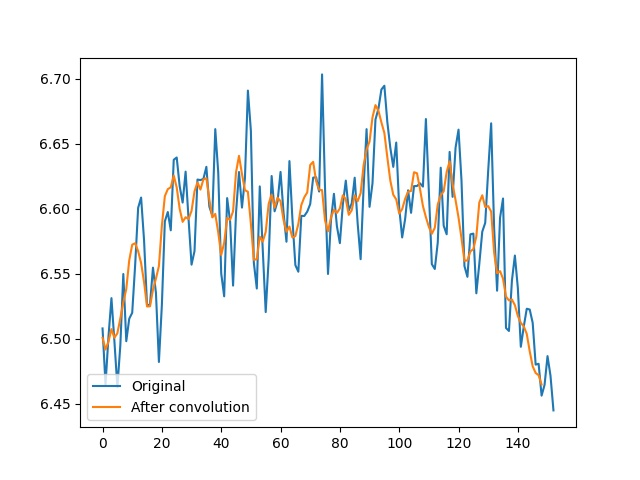
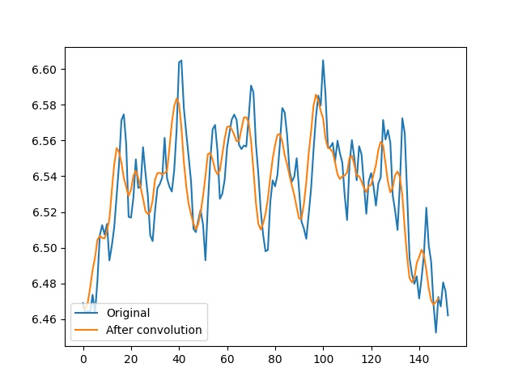
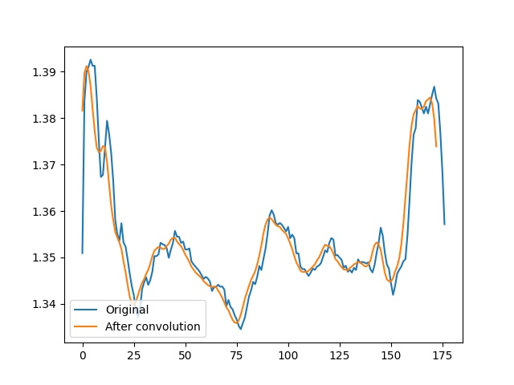

# BEST Hack A team final 

**Решение "Команды А" на финале хакатона BEST Hack 2021**

## Идея

Наша команда решала задачу обнажурения обоих биологических параметров: частоты сердцебиения и частоты дыхания. Алгоритмическая составляющая решения основана на Эйлеровом увеличении ([Eulerian Video Magnification](https://people.csail.mit.edu/mrub/evm/) - EVM). С помощью него происходило детектирование незаметных при использовании обычных методов движений человеческого тела, информация о которых необходима для анализа дыхания. С помощью этого же метода анализировался пульс человека.

Перед применением алгоритма EVM, мы использовали сегментирование кадров видео (Image segmentation) для выделения именно человека.

## Реализация

Все исходники написаны на языке Python 3. Для обработки изображений использовалась библиотека OpenCV, для модели сегментирования - модель на базе фреймворка Keras. Список всех использованных библиотек приведен в файле requirements.txt.

Также дополнительно реализованы модули для определения пола, возраста, а также настроения человека по изображению.

## Результаты

* Визуализировали паттерны дыхания и сердцебиения. Качество полученных графиков зависит от интенсивности фона исходного видео. Значения показателей соответствуют статистическим. Паттерны соответсуют кривым дыхания для нормальной группы.

* Выполнили распознавние пола, возраста и эмоций человека. Установили взаимосвязь между испытываемой эмоцией и значениями ЧСС и частотой дыхания.

****

**Нижние два графика иллюстрируют информацию полученную из видео с интенсивным фоном**

**А этот - с однородным задним фоном**

Как мы видим, однородный задний фон позволяет позволяет лучше выделить движения малой амплитуды.

Ниже приведены видео с однородным задним фоном:

До обработки:

И после:

## Приложения

Использованные в процессе первичного исследования материалы:

* https://people.csail.mit.edu/mrub/papers/vidmag.pdf

* https://lambda.qrilab.com/site/geko/

* https://www.ncbi.nlm.nih.gov/pmc/articles/PMC7663997/

* https://www.heart.org/en/healthy-living/fitness/fitness-basics/target-heart-rates
